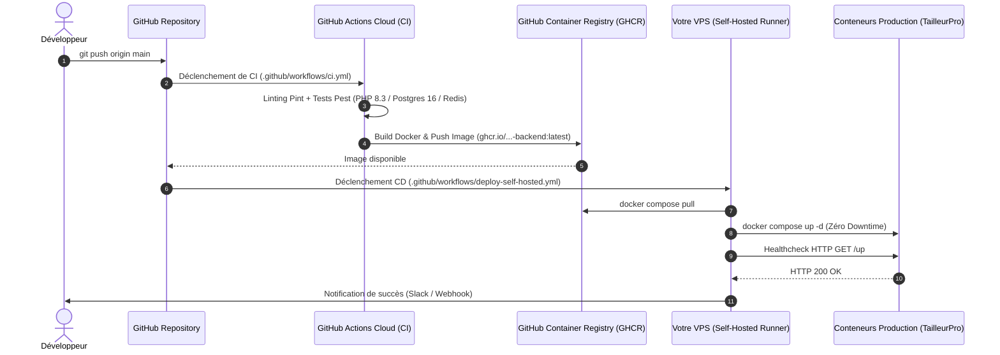

# 🚀 Guide de Déploiement Self-Hosted GitHub Actions — TailleurPro

Ce guide vous accompagne pas à pas pour configurer votre propre serveur VPS (Ubuntu / Debian / AlmaLinux) et y faire tourner les déploiements continus de **TailleurPro**.

---

## 🏗️ Fonctionnement du Pipeline End-to-End



---

## 🛠️ Étape 1 : Préparation du VPS

Connectez-vous à votre serveur en SSH :
```bash
ssh root@votre-ip-serveur
```

Exécutez le script d'installation automatique fourni :
```bash
curl -fsSL https://raw.githubusercontent.com/nosleepman1/tailor-app/main/scripts/setup-self-hosted-runner.sh | bash
```
*(Ou clonez le dépôt et lancez `bash scripts/setup-self-hosted-runner.sh`)*.

---

## 🔑 Étape 2 : Lier le Runner à votre Dépôt GitHub

1. Rendez-vous dans votre projet GitHub :
   ➔ **Settings** ➔ **Actions** ➔ **Runners** ➔ Cliquez sur **New self-hosted runner**.
2. Sélectionnez l'OS **Linux** et l'architecture **x64**.
3. Sur votre VPS dans le dossier `~/actions-runner`, exécutez la commande fournie par GitHub :
   ```bash
   ./config.sh --url https://github.com/nosleepman1/tailor-app --token VOTRE_TOKEN_GITHUB
   ```
4. Lors des invites :
   - Nom du runner : `tailleur-prod-vps`
   - Labels additionnels : `self-hosted,linux,tailor-prod`
   - Work folder : `_work`

---

## ⚙️ Étape 3 : Activer le Runner en Service Systemd (24h/24)

Pour que le runner tourne en arrière-plan et redémarre automatiquement après chaque reboot du serveur :
```bash
cd ~/actions-runner
sudo ./svc.sh install
sudo ./svc.sh start
sudo ./svc.sh status
```

---

## 🔒 Étape 4 : Configurer les Secrets GitHub du Dépôt

Dans **Settings ➔ Secrets and variables ➔ Actions**, ajoutez les secrets suivants :

| Secret | Description | Obligatoire |
| :--- | :--- | :--- |
| `PROD_ENV_FILE` | Contenu intégral de votre fichier `.env.production` | ✅ Oui |
| `SLACK_WEBHOOK_URL` | URL de Webhook Slack/Discord pour recevoir les alertes de déploiement | ⚪ Optionnel |

---

## 🚀 Étape 5 : Déclencher un Déploiement

Dès que vous poussez sur `main`, GitHub Actions compile l'image Docker, notifie votre VPS qui télécharge la nouvelle version, applique les migrations et vérifie la santé de l'API sans interruption de service !

Pour déclencher un déploiement manuel :
➔ Rendez-vous dans l'onglet **Actions** ➔ **Production CD (Self-Hosted Runner)** ➔ **Run workflow**.
