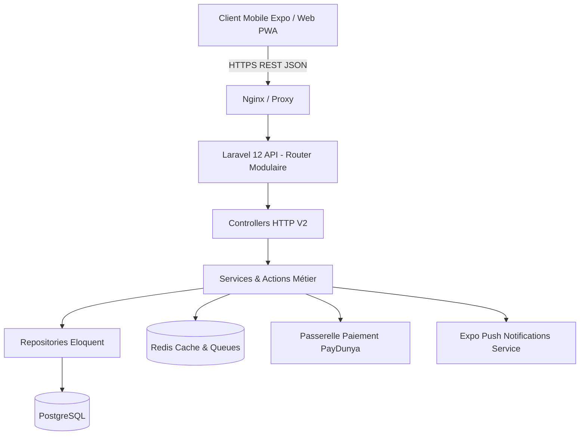

# 🧵 TailleurPro — Écosystème SaaS de Gestion pour Tailleurs

TailleurPro est une solution SaaS complète et haute performance conçue pour les artisans tailleurs et maisons de couture. Elle permet de gérer les fiches de mesures, le cycle de fabrication des commandes, les acomptes et la comptabilité d'atelier, avec un support **Offline-First** (mode hors-ligne en atelier) et une intégration de paiement **PayDunya**.

---

## 🏗️ Architecture Technique

Le backend est propulsé par **Laravel 12**, **PostgreSQL** et **Redis**, structuré selon une **Clean Architecture en Couches** :



### 🧱 Couches Architecturales
- **`app/Traits/ApiResponse.php`** : Formatage uniforme de toutes les réponses JSON (`success`, `message`, `data`, `meta`, `errors`).
- **`bootstrap/app.php`** : Intercepteur global d'exceptions (Validation, Auth, 404, 403, 429, 500) garantissant 100% de réponses JSON sans crash.
- **`app/Http/Controllers/Api/V2/`** : Contrôleurs allégés gérant uniquement la couche HTTP.
- **`app/Services/`** : Logique métier (Auth, Clients, Commandes, Dashboard agrégé, PayDunya, Sync, Expo Push).
- **`app/Repositories/`** : Inversion de contrôle et abstraction de l'accès aux données.
- **`routes/api/v2/`** : Découpage modulaire des routes (`auth`, `users`, `clients`, `commandes`, `events`, `dashboard`, `payments`, `admin`, `sync`).

---

## 🔐 Sécurité & Rôles (RBAC)

1. **Codes PIN Sécurisés** : Le code PIN à 4 chiffres des tailleurs est hashé avec `Hash::make()` en base de données et masqué de toute sérialisation JSON (`$hidden`).
2. **Rate Limiting (Anti Brute-force)** : Middleware `throttle:5,1` appliqué sur les routes d'authentification.
3. **RBAC Spatie & Policies** : Cloisonnement strict multi-tenant (`ClientPolicy`, `CommandePolicy`, `EventPolicy`, `UserPolicy`).
4. **Super Admin Platform** : Protection stricte par middleware `role:admin`.

---

## 🔑 Identifiants de Test & Données Pré-remplies

Exécutez les migrations et les seeders pour charger les comptes de test :
```bash
php artisan migrate:fresh --seed
```

| Rôle | Nom | Identifiant (Email / Téléphone) | Mot de passe / PIN | Forfait |
| :--- | :--- | :--- | :--- | :--- |
| **Super Admin** | Super Administrateur | `abdallahdiouf.dev@gmail.com` ou `771234567` | `Khoudia1970` | Illimité |
| **Tailleur Démo 1** | Atelier Makhtoum Couture | `773757077` ou `makhtoum@tailor.app` | PIN: `1234` (Mdp: `passer123`) | Premium |
| **Tailleur Démo 2** | ProCouture Dakar | `774731493` ou `procouture@tailor.app` | PIN: `5678` (Mdp: `passer123`) | Basique |

---

## 💳 Configuration PayDunya (Abonnements & Acomptes)

Dans votre fichier `.env` :
```env
PAYDUNYA_MODE=test # test ou live
PAYDUNYA_MASTER_KEY=votre_master_key
PAYDUNYA_PUBLIC_KEY=votre_public_key
PAYDUNYA_PRIVATE_KEY=votre_private_key
PAYDUNYA_TOKEN=votre_token

# URL Webhook (Pour tester les webhooks en local avec Ngrok)
# Lancez : ngrok http 8000
PAYDUNYA_WEBHOOK_URL=https://votre-sous-domaine.ngrok-free.app/api/v2/payments/webhook
PAYDUNYA_RETURN_URL=http://localhost:5173/subscription/success
PAYDUNYA_CANCEL_URL=http://localhost:5173/subscription/cancel
```

---

## 📚 Catalogue des Endpoints API V2

Toutes les routes sont préfixées par `/api/v2` :

### 1. Authentification (`auth.php`)
- `POST /api/v2/login` : Connexion par Téléphone/Email + PIN ou Mot de passe. *(Throttled)*
- `POST /api/v2/register` : Inscription d'un nouveau compte tailleur. *(Throttled)*
- `GET /api/v2/me` : Profil de l'utilisateur connecté avec rôles et statut d'abonnement.
- `POST /api/v2/logout` : Révocation du token d'accès Sanctum.

### 2. Paramètres & Préférences (`users.php`)
- `GET /api/v2/user/profile` : Informations de profil.
- `PUT /api/v2/user/profile` : Mise à jour nom, email, téléphone, ville.
- `PUT /api/v2/user/password` : Changement sécurisé de mot de passe.
- `GET /api/v2/user/preferences` : Préférences (thème, notifications).
- `PUT /api/v2/user/preferences` : Mise à jour des préférences.
- `POST /api/v2/user/push-token` : Enregistrement du token Expo Push.

### 3. Clients & Mesures (`clients.php`)
- `GET /api/v2/clients` : Liste paginée des clients du tailleur (avec recherche et nombre de commandes en cours).
- `POST /api/v2/clients` : Création d'un client avec ses mensurations complètes.
- `GET /api/v2/clients/{id}` : Fiche détaillée du client, mesures et historique de commandes.
- `PUT /api/v2/clients/{id}` : Mise à jour client et mesures.
- `DELETE /api/v2/clients/{id}` : Suppression d'un client.

### 4. Commandes & Production (`commandes.php`)
- `GET /api/v2/commandes` : Liste des commandes avec filtres par statut, client ou événement.
- `POST /api/v2/commandes` : Création de commande (avec client existant ou à la volée, photos, acompte).
- `GET /api/v2/commandes/{id}` : Détails de la commande, photos, événement et paiements.
- `PUT /api/v2/commandes/{id}` : Mise à jour de la commande et ajustement d'acompte.
- `PATCH /api/v2/commandes/{id}/status` : Transition de statut (`pending`, `in_progress`, `ready`, `delivered`, `cancelled`).
- `DELETE /api/v2/commandes/{id}` : Suppression d'une commande.

### 5. Événements & Calendrier (`events.php`)
- `GET /api/v2/events` : Liste des événements et fêtes religieuses/nationales (Tabaski, Korité, etc.).
- `GET /api/v2/events/upcoming` : Événements futurs.
- `POST /api/v2/events` : Création d'événement (Admin uniquement).

### 6. Dashboard & Métriques (`dashboard.php`)
- `GET /api/v2/dashboard` : Métriques de l'atelier (commandes actives, livraisons de la semaine, chiffre d'affaires, débiteurs, revenus par événement).

### 7. Paiements PayDunya (`payments.php`)
- `GET /api/v2/payments/plans` : Liste des forfaits disponibles.
- `GET /api/v2/payments/current` : Statut de l'abonnement en cours.
- `POST /api/v2/payments/checkout` : Initialisation d'une facture PayDunya (retourne `checkout_url`).
- `GET /api/v2/payments/verify` : Vérification du statut de la facture.
- `POST /api/v2/payments/webhook` : Webhook IPN PayDunya avec vérification SHA-512.

### 8. Super Admin (`admin.php`) *(Protégé par `role:admin`)*
- `GET /api/v2/admin/stats` : Métriques globales de la plateforme.
- `GET /api/v2/admin/tailors` : Liste des tailleurs enregistrés.
- `POST /api/v2/admin/tailors` : Création d'un tailleur avec génération automatique du PIN.
- `PATCH /api/v2/admin/tailors/{id}/status` : Activation / désactivation d'un compte tailleur.
- `DELETE /api/v2/admin/tailors/{id}` : Suppression d'un compte tailleur.

### 9. Synchronisation Offline-First Expo (`sync.php`)
- `GET /api/v2/sync/pull?last_synced_at=...` : Récupération des deltas modifiés depuis le dernier sync.
- `POST /api/v2/sync/push` : Transmission des créations/modifications effectuées hors-ligne sur mobile.

---

## 🧪 Tests Unitaires & Fonctionnels

Pour exécuter la suite de tests Pest / PHPUnit :
```bash
php artisan test
```
