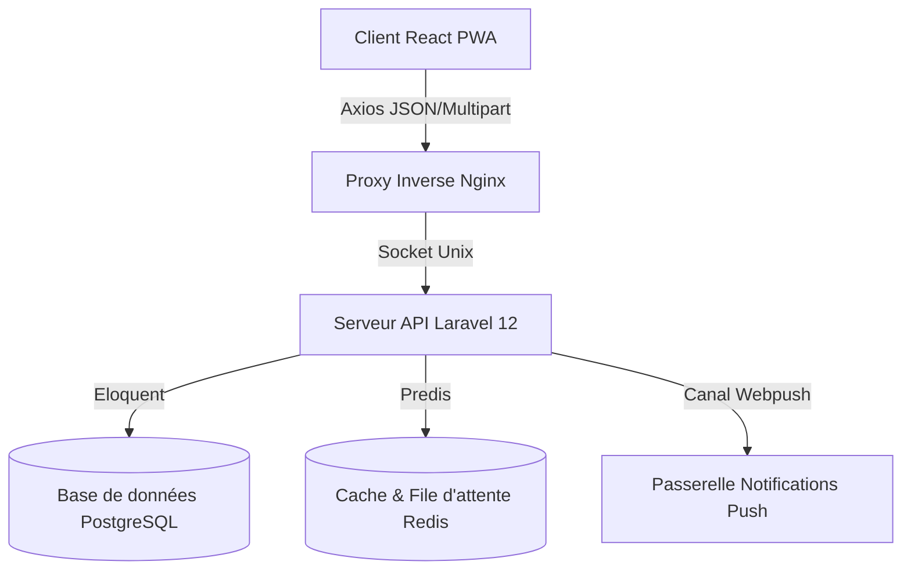

# TailleurPro — Hub du Système

TailleurPro est un écosystème de gestion de tailleurs et de suivi des commandes. Il se compose d'un client React sous forme de Progressive Web App (PWA) mobile-first et d'un serveur API Laravel 12 robuste et sécurisé, soutenu par des conteneurs PostgreSQL et Redis.

---

## 🏗️ Aperçu de l'Architecture

L'architecture du système est divisée en trois composants principaux : le client, le serveur et les couches d'infrastructure.



### 📂 Structure du Dépôt

- **[client/](file:///c:/Users/abash/Desktop/_/PROJECTS/BIG/tailor-app/client)** : Application frontend React / Vite / Tailwind CSS.
- **[server/](file:///c:/Users/abash/Desktop/_/PROJECTS/BIG/tailor-app/server)** : Application backend API Laravel 12.
- **[docker-compose.yml](file:///c:/Users/abash/Desktop/_/PROJECTS/BIG/tailor-app/docker-compose.yml)** : Orchestration de haut niveau pour le développement local et les environnements de staging.
- **[.github/workflows/](file:///c:/Users/abash/Desktop/_/PROJECTS/BIG/tailor-app/.github/workflows)** : Configurations CI/CD, tests unitaires, scans de sécurité et déploiements.

---

## 💻 Client Frontend

Le frontend est une Progressive Web App (PWA) construite avec React 18, Vite et Tailwind CSS. Il est entièrement responsive, orienté mobile-first, et prend en charge un mode hors ligne complet.

### Fonctionnalités Clés
- **Mode Hors Ligne** : Fonctionne hors ligne via des files d'attente dans le stockage local (`offlineQueue.js`) et un gestionnaire de synchronisation automatique (`syncManager.js`) au retour de la connexion.
- **Interface Interactive** : Formulaires de création de clients en plusieurs étapes, listes de clients avec recherche floue, graphiques statistiques interactifs avec `Chart.js` & `Recharts`, et composants de notifications dynamiques.
- **Service Worker / PWA** : Support intégré pour la mise en cache des assets via `vite-plugin-pwa` et bannières hors ligne d'avertissement.

### Technologies Principales
- **Framework** : React 18 & Vite 8
- **Styling** : Tailwind CSS
- **Gestion d'État** : Zustand
- **Requêtes & Cache** : TanStack React Query & Axios
- **Support Hors ligne** : Workbox / PWA Plugin

---

## ⚙️ Serveur API Backend

L'API est propulsée par Laravel 12 et fournit une authentification de type OAuth via Laravel Sanctum, des autorisations basées sur les rôles, des tâches en arrière-plan, et des canaux de notifications push.

### Fonctionnalités Clés
- **Gestion des Versions d'API** : Architecture standardisée pour les API v1 et v2 (`routes/api.php`).
- **Rôles & Autorisations** : Gestion des accès fins basée sur des Policies Laravel et le package Spatie Laravel Permission.
- **Notifications Web Push** : Système d'abonnement et d'envoi de push web basé sur l'échange de clés VAPID.
- **Facturation & Abonnements** : Schéma d'abonnements et historique des paiements (Note : *ces fonctionnalités sont actuellement désactivées dans les routes V2*).

### Schéma de Base de Données / Modèles Eloquent
- **[User](file:///c:/Users/abash/Desktop/_/PROJECTS/BIG/tailor-app/server/app/Models/User.php)** : Tailleurs ou Administrateurs (configuration du profil, préférences de notification).
- **[Client](file:///c:/Users/abash/Desktop/_/PROJECTS/BIG/tailor-app/server/app/Models/Client.php)** : Clients (données démographiques, mensures stockées sous forme de tableau JSON).
- **[Commande](file:///c:/Users/abash/Desktop/_/PROJECTS/BIG/tailor-app/server/app/Models/Commande.php)** : Commandes (délais, statut des paiements, liaisons aux clients et événements).
- **[Event](file:///c:/Users/abash/Desktop/_/PROJECTS/BIG/tailor-app/server/app/Models/Event.php)** : Événements d'agenda / rendez-vous.
- **[Measurement](file:///c:/Users/abash/Desktop/_/PROJECTS/BIG/tailor-app/server/app/Models/Measurement.php)** : Fiches de mesures de couture détaillées.
- **PaymentLog**, **Revenue**, **Subscription** : Logs de transactions, suivi des revenus et abonnements de licence.

---

## 🐳 DevOps & Conteneurisation

### 1. Architectures Docker

#### 🟢 Conteneur Client — [client/Dockerfile](file:///c:/Users/abash/Desktop/_/PROJECTS/BIG/tailor-app/client/Dockerfile)
Basé sur une image légère `node:20-alpine`, ce conteneur fait tourner l'application cliente en mode développement/preview :
- Répertoire de travail : `/app/`
- Port exposé : `5173`
- Commande par défaut : `npm run dev`

#### 🔵 Conteneur Serveur — [server/Dockerfile](file:///c:/Users/abash/Desktop/_/PROJECTS/BIG/tailor-app/server/Dockerfile)
Une construction multi-étapes (multi-stage) conçue pour la mise en production :
- **Étape 1 (Composer)** : Utilise `composer:2.7` pour installer les dépendances backend de production avec chargement optimisé (`--optimize-autoloader`).
- **Étape 2 (App)** : Utilise `php:8.3-fpm-alpine`, configure le cache des routes/configurations Laravel, communique via sockets Unix FPM, et installe les extensions PHP nécessaires (Zip, BCMath, Intl, PDO PostgreSQL/MySQL, MBString).
- **Orchestration des Processus** : Lance Nginx (port par défaut `8080`) et PHP-FPM en utilisant **Supervisor** comme gestionnaire de processus PID-1.
- **Vérification d'état (Health Check)** : Surveille la santé via `curl -f http://localhost:8080/up || exit 1`.

### 2. Fichiers de Configuration des Services
- **[php-fpm.conf](file:///c:/Users/abash/Desktop/_/PROJECTS/BIG/tailor-app/server/docker/php/php-fpm.conf)** : Restreint l'utilisateur du pool à `laravel`, expose le socket Unix et configure la gestion dynamique des processus (`max_children = 20`, `start_servers = 4`).
- **[php.ini](file:///c:/Users/abash/Desktop/_/PROJECTS/BIG/tailor-app/server/docker/php/php.ini)** : Sécurise et optimise PHP pour la production (limite mémoire à 256M, taille max d'upload à 64M, désactivation de l'affichage des erreurs et de `allow_url_fopen`).
- **[default.conf](file:///c:/Users/abash/Desktop/_/PROJECTS/BIG/tailor-app/server/docker/nginx/default.conf)** : Envoie les en-têtes de sécurité (no-sniff, xss-protection, frame-options), transmet les requêtes PHP au socket Unix FPM, bloque l'accès aux fichiers sensibles (`.env`, `.git`), et définit des règles de cache long pour les assets statiques.
- **[supervisord.conf](file:///c:/Users/abash/Desktop/_/PROJECTS/BIG/tailor-app/server/docker/supervisor/supervisord.conf)** : Gère le cycle de vie de `php-fpm` et `nginx`. Contient des blocs commentés configurables pour exécuter des workers de file d'attente Laravel (`queue:work`).
- **[entrypoint.sh](file:///c:/Users/abash/Desktop/_/PROJECTS/BIG/tailor-app/server/docker/entrypoint.sh)** : Crée automatiquement les liens symboliques de stockage, exécute les migrations de base de données, vide les caches et démarre Supervisor.

### 3. Orchestration Docker Compose
Le fichier racine **[docker-compose.yml](file:///c:/Users/abash/Desktop/_/PROJECTS/BIG/tailor-app/docker-compose.yml)** orchestre l'ensemble des services en local.

| Service | Image/Source Build | Port Hôte | Dossier Partagé / Volume |
|:---|:---|:---|:---|
| `frontend` | `./client` | `5173:5173` | `./client:/app` |
| `backend` | `./server` | `8000:8000` | `./server:/var/www/html` |
| `nginx` | `./nginx` | `80:80` | `./nginx:/etc/nginx/conf.d` |
| `db` | `postgres:18.1-alpine` | `5432:5432` | `./db:/var/lib/postgresql/data` |
| `redis` | `redis:8.4.0-alpine` | `6379:6379` | `./redis:/data` |

> [!WARNING]
> Assurez-vous que le répertoire `./nginx` existe à la racine du projet ou mettez à jour les chemins de volume du service `nginx` dans `docker-compose.yml` avant de lancer les conteneurs.

---

## 🚀 Pipelines CI/CD

Les processus d'intégration automatisés sont gérés via GitHub Actions.

### 1. Qualité du Code & Tests d'Intégration — [.github/workflows/pr-checks.yml](file:///c:/Users/abash/Desktop/_/PROJECTS/BIG/tailor-app/.github/workflows/pr-checks.yml)
Déclenché sur les pull requests ciblant `main`, `staging` ou `develop`.
- **Scanners de Sécurité** : Détecte les secrets avec Trufflehog et analyse le code pour les vulnérabilités avec Trivy (rapport envoyé à GitHub Security).
- **Tests d'Intégration** : Instancie un service PostgreSQL temporaire, configure l'environnement et joue la suite de tests Pest d'intégration (`tests/Integration`).
- **Audit Lighthouse** : Évalue les métriques de performance et de qualité sur le build frontend compilé.

### 2. Pipeline Principal de Déploiement — [.github/workflows/ci-cd.yml](file:///c:/Users/abash/Desktop/_/PROJECTS/BIG/tailor-app/.github/workflows/ci-cd.yml)
Déclenché sur les pushs vers `main`, `develop`, `staging`.
- **Tests & Qualité Backend** : Configure PHP 8.2 et Postgres, joue les tests unitaires Pest, valide la mise en forme du code avec Laravel Pint et publie les rapports.
- **Build Frontend** : Installe les dépendances et compile le code React pour l'upload d'artefacts.
- **Publication Docker** : Compile et pousse automatiquement l'image Docker de production sur le registre de paquets GitHub Container Registry (`ghcr.io`).
- **Déploiement Automatique** :
  - Frontend : Déployé sur **Vercel**.
  - Backend : Déployé sur **Railway** (via CLI) ou via webhook **Render**.
- **Alertes** : Envoie des notifications de statut de déploiement sur les canaux **Slack**.

---

## 🛠️ Configuration & Installation Locale

### Lancement avec Docker Compose (Recommandé)
Démarrez l'ensemble des conteneurs avec une seule commande :
```bash
docker-compose up -d --build
```
- Frontend : [http://localhost:5173](http://localhost:5173)
- Backend : [http://localhost:8000](http://localhost:8000)

### Configuration Manuelle (Sans Docker)

#### 💻 1. Configuration du Frontend
```bash
cd client
cp .env.example .env.development
npm install
npm run dev
```

#### ⚙️ 2. Configuration du Backend
Assurez-vous d'avoir PHP 8.2+ et Composer installés localement.
```bash
cd server
cp .env.example .env
composer install
php artisan key:generate
php artisan migrate --seed
php artisan serve
```
Pour démarrer le traitement des files d'attente en arrière-plan :
```bash
php artisan queue:work
```

---

## 🔑 Variables d'Environnement

### Variables du Client (`client/.env.development`)
- `VITE_API_URL` : URL de base du serveur API (ex: `http://localhost:8000/api/v2`).

### Variables du Serveur (`server/.env`)
- `DB_CONNECTION` : `pgsql` / `mysql`
- `DB_HOST`, `DB_PORT`, `DB_DATABASE`, `DB_USERNAME`, `DB_PASSWORD`
- `REDIS_HOST`, `REDIS_PORT`
- `WEBPUSH_VAPID_PUBLIC_KEY`, `WEBPUSH_VAPID_PRIVATE_KEY`

---

## 👥 Rôles & Accès aux Routes

| Rôle Utilisateur | Portée des Routes | Chemins d'Accès |
|:---|:---|:---|
| **Admin** | Dashboard d'administration & comptes utilisateurs | `/admin/dashboard`, `/admin/users`, `/admin/clients` |
| **Client (Tailleur)** | Gestion des clients, mesures et suivi des commandes | `/dashboard`, `/clients`, `/clients/new`, `/clients/:id/edit` |
